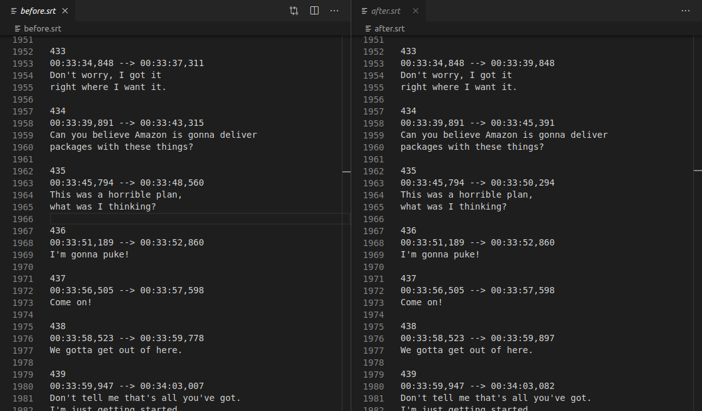

# Substretch
Automatically stretch timing in subtitle files so slow readers can keep up.

Output to stdout.

Currently supported file formats: .srt, .ass.



## Building 
```
make
```

## Usage
```
./substretch.out -h
```
